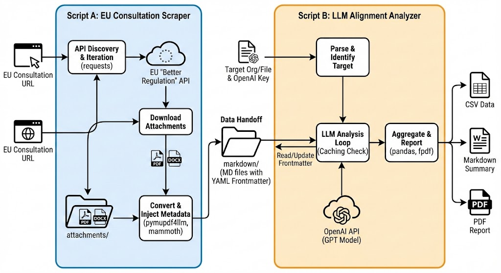

## Disclaimer
This code is vibe-coded. It works, but the structure is not robust and should not be relied upon.

# EU Consultation Analysis Pipeline

An automated system for scraping EU consultation submissions, processing attachments, and performing LLM-based alignment analysis to identify allies and opponents in policy consultations.

## Overview

This project consists of two main components that work together to automate the analysis of EU consultation submissions:

1. **EU Consultation Scraper** - Scrapes public EU consultation data, downloads attachments (PDFs and DOCX files), and converts them to structured markdown with metadata
2. **LLM Alignment Analyzer** - Analyzes submissions using Large Language Models to identify alignment, agreements, and disagreements with a target organization's position

## Architecture



The system consists of two main scripts that work together:

**Script A: EU Consultation Scraper** (Blue section)
- Takes EU Consultation URLs as input
- Discovers and iterates through the EU 'Better Regulation' API
- Downloads PDF and DOCX attachments
- Converts files to markdown with YAML frontmatter metadata
- Stores processed data in the `markdown/` folder

**Script B: LLM Alignment Analyzer** (Orange section)
- Takes target organization/file and OpenAI API key as input
- Parses and identifies the target submission
- Performs LLM analysis with caching (reads/updates frontmatter)
- Uses OpenAI GPT models for comparison analysis
- Aggregates results and generates reports in CSV, Markdown, and PDF formats

## Features

### Script A: EU Consultation Scraper
- 🔍 **API Discovery** - Automatically discovers and iterates through EU 'Better Regulation' API endpoints
- 📥 **Attachment Download** - Downloads PDF and DOCX attachments from consultation submissions
- 🔄 **Format Conversion** - Converts PDFs (using `pymupdf4llm`) and DOCX files (using `mammoth`) to markdown
- 📝 **Metadata Injection** - Injects submission metadata as YAML frontmatter in markdown files
- 💾 **Structured Storage** - Organizes files by consultation initiative in `attachments/` and `markdown/` directories

### Script B: LLM Alignment Analyzer
- 🤖 **LLM-Powered Analysis** - Uses OpenAI GPT models to compare submissions and identify alignment
- 💾 **Caching System** - Stores analysis results in markdown frontmatter to avoid redundant API calls
- 📊 **Multi-Format Reports** - Generates comprehensive reports in CSV, Markdown, and PDF formats
- 🎯 **Alignment Scoring** - Provides 0-10 alignment scores and verdicts (Likely Ally, Neutral, Opponent)
- 📈 **Stakeholder Categorization** - Identifies top allies and opponents based on alignment scores

## Installation

### Prerequisites

- Python 3.8 or higher
- OpenAI API key

### Setup

1. Clone the repository:
```bash
git clone <repository-url>
cd Submissions
```

2. Install dependencies:
```bash
pip install -r requirements.txt
```

3. Create a `.env` file in the project root:
```env
OPENAI_API_KEY=your_openai_api_key_here
```

## Usage

### Step 1: Scrape EU Consultation Data

Run the scraper with one or more EU consultation URLs:

```bash
python eu_scraper.py "https://ec.europa.eu/info/law/better-regulation/have-your-say/initiatives/14842-Chips-Act-2_en"
```

**Options:**
- `url` - EU consultation initiative URL (required)
- `--output` / `-o` - Custom output JSON filename (optional)

**Output:**
- Downloads attachments to `attachments/{Initiative Title}/`
- Converts to markdown in `markdown/{Initiative Title}/`
- Saves submission metadata to `submissions_{Initiative Title}.json`

### Step 2: Analyze Submissions with LLM

Configure the analysis parameters in `analyze_llm.py`:

```python
target_file = "The Centre for Future Generations.md"
target_org = "Centre for Future Generations"
base_dir = "markdown/2025 Strategic Foresight Report"
model = "gpt-5-mini"  # or "gpt-4", "gpt-3.5-turbo", etc.
```

Then run the analyzer:

```bash
python analyze_llm.py
```

**Output:**
- `llm_analysis_report.csv` - Detailed alignment data for all submissions
- `llm_analysis_summary.md` - Human-readable summary with top allies and opponents
- `llm_analysis_report.pdf` - Professional PDF report with table of contents and detailed analysis

## Project Structure

```
.
├── eu_scraper.py              # Script A: EU Consultation Scraper
├── analyze_llm.py             # Script B: LLM Alignment Analyzer
├── requirements.txt            # Python dependencies
├── .env                       # Environment variables (create this)
├── attachments/               # Downloaded PDF/DOCX files
│   └── {Initiative Title}/
├── markdown/                  # Converted markdown files with frontmatter
│   └── {Initiative Title}/
├── submissions_*.json         # Raw submission data
├── llm_analysis_report.csv     # Analysis results (CSV)
├── llm_analysis_summary.md     # Analysis summary (Markdown)
└── llm_analysis_report.pdf     # Analysis report (PDF)
```

## Configuration

### OpenAI Model Selection

The LLM analyzer supports various OpenAI models. Update the `model` variable in `analyze_llm.py`:

- `gpt-5-mini` - Fast and cost-effective (default)
- `gpt-4` - Higher quality analysis
- `gpt-3.5-turbo` - Balanced performance

### Analysis Parameters

The LLM analysis uses the following scoring system:
- **Alignment Score**: 0-10 scale (0 = Completely Opposed, 10 = Perfectly Aligned)
- **Verdict**: One of "Likely Ally", "Neutral", or "Opponent"

## Output Formats

### CSV Report (`llm_analysis_report.csv`)
Contains columns:
- `Organization` - Name of the organization
- `LLM_Alignment_Score` - Alignment score (0-10)
- `Verdict` - Likely Ally / Neutral / Opponent
- `Agreements` - Summary of alignment points
- `Disagreements` - Summary of divergence points

### Markdown Summary (`llm_analysis_summary.md`)
Human-readable summary featuring:
- Top 10 allies (highest alignment scores)
- Top 10 opponents (lowest alignment scores)
- Detailed breakdown for each organization

### PDF Report (`llm_analysis_report.pdf`)
Professional PDF report including:
- Table of contents with clickable links
- Summary statistics
- Top allies section
- Top opponents section
- Detailed analysis for all organizations
- Full results table

## Caching

The LLM analyzer implements intelligent caching:
- Analysis results are stored in markdown frontmatter
- Re-running the analysis skips already-analyzed submissions
- Cache keys: `llm_alignment_score`, `llm_verdict`, `llm_agreements`, `llm_disagreements`

To force re-analysis, remove the LLM keys from the markdown frontmatter or delete the markdown files.

## Dependencies

- `pandas` - Data manipulation and CSV generation
- `PyYAML` - YAML frontmatter parsing
- `python-dotenv` - Environment variable management
- `openai` - OpenAI API client
- `fpdf2` - PDF report generation
- `requests` - HTTP requests for API scraping
- `pymupdf4llm` - PDF to markdown conversion
- `mammoth` - DOCX to markdown conversion

## Limitations

- Rate limiting: The scraper includes a 0.5s delay between API requests
- File naming: Multiple attachments from the same organization may require collision handling
- API changes: EU API structure changes may require code updates
- Cost: LLM analysis incurs OpenAI API costs based on model and submission volume

## Contributing

Contributions are welcome! Please feel free to submit a Pull Request.

## License

[Specify your license here]

## Acknowledgments

- EU 'Better Regulation' Portal for providing public consultation data
- OpenAI for LLM capabilities
- Open source libraries: pymupdf4llm, mammoth, fpdf2, and others
